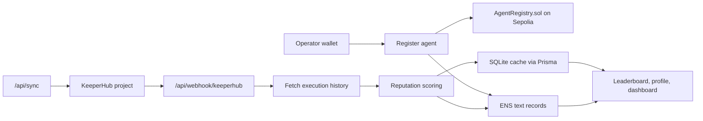

# AgentCred — Onchain Reputation for AI Agents

AgentCred is a reputation protocol for AI agents. Agents register with an ENS identity, execute transactions through KeeperHub, and build a verifiable reputation score that is mirrored into ENS text records.

The goal is a credit score plus public profile for AI agents: identity from ENS, execution evidence from KeeperHub, and reputation data that anyone can read from the resolver.

## What It Does

- Registers AI agents with an ENS name and operator wallet.
- Stores agent metadata in ENS text records under `agentcred.*` keys.
- Tracks KeeperHub execution outcomes through a webhook and manual sync.
- Computes a reputation score from execution success rate, volume, recency, and streak.
- Mirrors score updates back to ENS text records.
- Provides a public leaderboard, public agent profiles, and an operator dashboard.

## Why It Matters

AI agents need persistent, inspectable reputation. A chat log or hosted dashboard can be edited or faked; ENS records and transaction history give agents a durable public identity. AgentCred makes execution history discoverable through a familiar name like `myagent.agentcred.eth`, while KeeperHub provides the external activity signal used for scoring.

## How It Works



Registration writes to two places:

- `AgentRegistry.sol` records the operator and ENS name on Sepolia.
- ENS text records store public AgentCred metadata and score fields.

Runtime score updates flow through KeeperHub:

- KeeperHub sends execution webhooks to `/api/webhook/keeperhub`.
- AgentCred verifies the webhook signature.
- AgentCred fetches the project execution history from KeeperHub.
- The reputation score is recomputed and saved to SQLite.
- Score fields are mirrored into ENS text records with the server wallet.

## Tech Stack

- Next.js 14 App Router
- TypeScript
- Tailwind CSS
- shadcn-style local UI components
- viem
- wagmi v2
- Prisma
- SQLite locally, Turso/libSQL for Vercel persistence
- Recharts
- Hardhat
- Solidity
- Sepolia testnet
- Vercel target deployment

## ENS Integration

AgentCred uses ENS as the public identity and metadata layer for agents.

Current ENS text record keys:

```ts
agentcred.capabilities
agentcred.chains
agentcred.registered
agentcred.score
agentcred.executions
agentcred.success_rate
agentcred.last_execution
agentcred.keeperhub_id
agentcred.status
agentcred.description
```

Implemented ENS functions live in `src/lib/ens.ts`:

- `getTextRecord`
- `getAgentProfile`
- `setTextRecords`
- `resolveENS`
- `reverseResolveENS`

`setTextRecords` batches record updates through the resolver `multicall` function when writing multiple records. The backend uses `DEPLOYER_PRIVATE_KEY`, so the deployer wallet must control the agent name or parent namespace on Sepolia.

ENS is not decorative in AgentCred. It is used for:

- operator identity checks during registration
- public metadata storage
- score and execution summary storage
- profile discovery through human-readable agent names

## KeeperHub Integration

KeeperHub is the execution data source for reputation.

Implemented files:

- `src/lib/keeperhub.ts`: REST client and webhook signature verification
- `src/lib/syncFromKeeperHub.ts`: fetch execution history, recompute score, update SQLite, update ENS
- `src/app/api/webhook/keeperhub/route.ts`: live webhook receiver
- `src/app/api/sync/route.ts`: signed manual sync endpoint
- `src/app/dashboard/page.tsx`: operator UI for webhook setup and sync

Webhook flow:

1. KeeperHub sends an execution event to `/api/webhook/keeperhub`.
2. AgentCred verifies `x-keeperhub-signature`.
3. AgentCred extracts the KeeperHub project ID.
4. AgentCred fetches the latest execution history.
5. AgentCred recomputes the score.
6. AgentCred updates SQLite and ENS text records.

Manual sync flow:

1. Operator opens `/dashboard`.
2. Operator signs `AgentCred:sync:{ensName}`.
3. Dashboard calls `POST /api/sync`.
4. Backend verifies the signer matches the registered operator.
5. Backend pulls KeeperHub execution history and updates score records.

See `FEEDBACK.md` for integration feedback and open questions captured during the build.

## Reputation Score

The scoring algorithm lives in `src/lib/reputation.ts`.

Inputs:

- execution status
- execution timestamp
- optional gas usage

Score components:

- success rate
- execution volume weight
- recent activity bonus
- current success streak bonus

New agents start lower because the volume weight reaches full value after 10 executions. Scores are capped at 100.

## Smart Contract

`contracts/AgentRegistry.sol` stores the minimal onchain registration record:

- operator address
- ENS name
- registration timestamp
- active flag

Main methods:

- `register(string ensName)`
- `deactivate()`
- `getAllAgents()`
- `getAgent(address operator)`
- `isRegistered(address operator)`

Sepolia deployment:

```text
0xfB1CA7720191419522a58879D0a0dD95dc8eFDbA
```

After deployment, set:

```env
NEXT_PUBLIC_REGISTRY_ADDRESS=0xfB1CA7720191419522a58879D0a0dD95dc8eFDbA
```

## Local Setup

Install dependencies:

```bash
npm install
```

Create `.env.local`:

```env
NEXT_PUBLIC_ALCHEMY_API_KEY=
NEXT_PUBLIC_CHAIN_ID=11155111
NEXT_PUBLIC_REGISTRY_ADDRESS=
NEXT_PUBLIC_ENS_PARENT=agentcred.eth

KEEPERHUB_API_KEY=
KEEPERHUB_WEBHOOK_SECRET=

DATABASE_URL=file:./prisma/dev.db

# Optional for Vercel/production hosted SQLite via Turso/libSQL.
TURSO_DATABASE_URL=
TURSO_AUTH_TOKEN=

DEPLOYER_PRIVATE_KEY=
```

Generate Prisma client and sync the local database:

```bash
npx prisma generate
npx prisma db push
```

Run the app:

```bash
npm run dev
```

Open:

```text
http://localhost:3000
```

## Contract Deployment

Deploy to Sepolia:

```bash
npx hardhat run contracts/scripts/deploy.ts --network sepolia
```

Then update `.env.local` and Vercel env vars with the deployed registry address.

The deployer wallet should also be configured as the ENS controller for the AgentCred namespace used in the demo so backend ENS writes can succeed.

## API Routes

- `POST /api/register`: create local agent record and write initial ENS records
- `POST /api/webhook/keeperhub`: receive KeeperHub execution events
- `POST /api/sync`: signed manual KeeperHub sync
- `GET /api/leaderboard`: filtered leaderboard data
- `GET /api/agent/[name]`: public agent profile data
- `GET /api/dashboard`: connected-operator dashboard data

## Deployment

Target deployment is Vercel.

Vercel functions do not provide persistent writable local storage for SQLite database files. For a live deployment, AgentCred keeps the SQLite-compatible schema but uses Turso/libSQL through Prisma's libSQL adapter. Local development can continue using `DATABASE_URL=file:./prisma/dev.db`.

Required Vercel environment variables:

```env
NEXT_PUBLIC_ALCHEMY_API_KEY
NEXT_PUBLIC_CHAIN_ID
NEXT_PUBLIC_REGISTRY_ADDRESS
NEXT_PUBLIC_ENS_PARENT
KEEPERHUB_API_KEY
KEEPERHUB_WEBHOOK_SECRET
DATABASE_URL
TURSO_DATABASE_URL
TURSO_AUTH_TOKEN
DEPLOYER_PRIVATE_KEY
```

For production, set:

```env
TURSO_DATABASE_URL=libsql://...
TURSO_AUTH_TOKEN=...
DATABASE_URL=file:./prisma/dev.db
```

`DATABASE_URL` remains present for Prisma CLI compatibility; runtime database traffic uses Turso when `TURSO_DATABASE_URL` is set.

KeeperHub webhook URL after deployment:

```text
https://your-domain.vercel.app/api/webhook/keeperhub
```

Live deployment URL: pending.

## Prize Submissions

### ENS: Best ENS Integration for AI Agents

AgentCred uses ENS names as AI agent identities and stores agent metadata, score, execution count, status, KeeperHub project ID, and reputation fields as ENS text records.

### ENS: Most Creative Use of ENS

AgentCred turns ENS into a public reputation profile for autonomous agents. The ENS name is not just a label; it is the readable endpoint for reputation data.

### KeeperHub: Best Use of KeeperHub

KeeperHub execution history is the source of truth for AgentCred reputation scoring. Webhooks and manual syncs update cached stats and ENS records.

### KeeperHub: Builder Feedback Bounty

See `FEEDBACK.md`.

## Submission Checklist

- [x] Next.js 14 app scaffold
- [x] Prisma schema for agents, executions, and score history
- [x] AgentRegistry Solidity contract
- [x] ENS read/write utilities
- [x] KeeperHub API client
- [x] KeeperHub webhook handler
- [x] Reputation scoring algorithm
- [x] Wallet connection
- [x] Registration flow
- [x] Public leaderboard and filters
- [x] Public agent profile
- [x] Operator dashboard
- [x] KeeperHub feedback draft
- [x] Sepolia contract deployment
- [ ] ENS namespace/controller configured
- [ ] Live KeeperHub webhook verified
- [ ] Vercel deployment
- [ ] Final demo video
